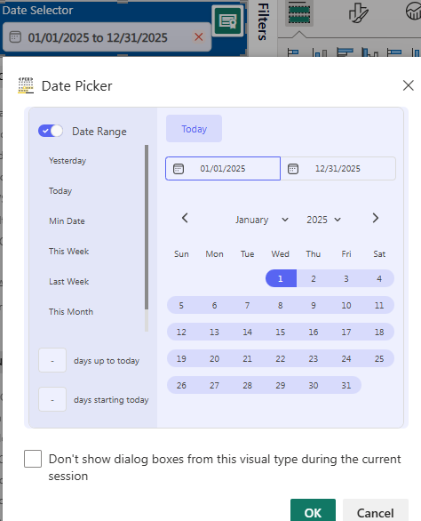

# Date Slicer — Power BI Custom Visual

A modern date picker slicer for Power BI with calendar navigation, quick presets, range selection, and a compact dropdown mode.



## Features

- **Calendar grid** — Full month view with previous/next navigation, month and year dropdowns
- **Range selection** — Click two dates to select a range, or toggle to single-date mode
- **Quick presets** — One-click shortcuts: Today, Yesterday, This Week, Last Week, This Month, Min Date
- **Days up to / starting today** — Enter a number to auto-select the last N or next N days
- **Compact dropdown mode** — A pill shows the selected range; click to open the full calendar as a floating overlay
- **Configurable first day of week** — Sunday or Monday (affects week-based presets too)
- **Sidebar toggle** — Show or hide the presets sidebar
- **Default preset** — Automatically apply a preset on first load (Today, This Week, etc.)
- **Custom appearance** — Accent, background, text, and border colors via the format pane
- **Responsive layout** — Automatically shrinks controls when the tile is small
- **Filter persistence** — Restores the selected range when reopening a report

## Data Requirements

Drag a single **Date** field into the visual's data well.

| Data role | Kind     | Max |
|-----------|----------|-----|
| Date      | Grouping | 1   |

The visual reads all distinct dates (up to 30,000) to determine the available date range.

## Format Pane Settings

### Calendar

| Setting          | Options                                           | Default  |
|------------------|---------------------------------------------------|----------|
| First day of week | Sunday, Monday                                   | Sunday   |
| Show sidebar     | On / Off                                          | On       |
| Default preset   | None, Today, This Week, This Month, Last Week     | None     |
| Display mode     | Expanded, Compact                                 | Expanded |

### Appearance

| Setting          | Type         | Default   |
|------------------|--------------|-----------|
| Accent color     | Color picker | `#00539A` |
| Background color | Color picker | `#FFFFFF` |
| Text color       | Color picker | `#11284C` |
| Border color     | Color picker | `#D9E1EA` |

## Display Modes

### Expanded (default)

The full calendar is always visible with an optional sidebar of presets.

### Compact

A pill-shaped button displays the currently selected date range (e.g. `02/23/2026 — 03/01/2026`). Clicking the pill opens the full calendar as a dropdown overlay. Clicking outside closes it.

## Development

**Prerequisites:** Node.js, npm, and the Power BI Visual Tools CLI.

```bash
npm install -g powerbi-visuals-tools
```

**Install dependencies:**

```bash
cd dateslicer
npm install
```

**Run locally** (requires a developer certificate and Power BI Developer Visual enabled):

```bash
pbiviz start
```

**Package for import:**

```bash
pbiviz package
```

The output `.pbiviz` file is created in the `dist/` folder. Import it into Power BI Desktop via **Insert → More Visuals → Import a visual from a file**.

## Project Structure

```
dateslicer/
├── capabilities.json        # Data roles, objects, and format properties
├── pbiviz.json              # Visual metadata (name, version, GUID)
├── src/
│   ├── visual.ts            # Main visual lifecycle (constructor, update, filter)
│   ├── calendarRenderer.ts  # DOM construction and rendering
│   ├── dateUtils.ts         # Date math, presets, grid generation
│   └── settings.ts          # Format pane model (calendar + appearance cards)
├── style/
│   └── visual.less          # All styles (pill, dropdown, grid, sidebar)
└── assets/
    └── icon.png             # Visual icon
```

## Author

Jamie Crone
